# Upscalify (WiP)

This is a repository for my experiments with transformer-based image super-resolution methods for my research project at
the [Vytautas Magnus University](https://www.vdu.lt/en/).

## Methods

### SwinIR

Paper: [SwinIR: Image Restoration Using Swin Transformer](./papers/2108.10257v1-SwinIR.pdf)

#### Training

| Loss                                            | PSNR                                            | SSIM                                            |
|-------------------------------------------------|-------------------------------------------------|-------------------------------------------------|
| 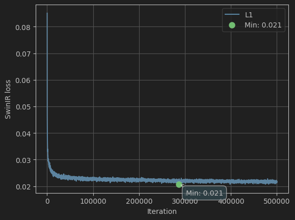 | 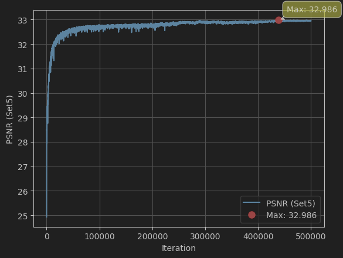 | 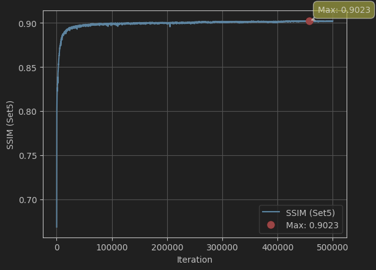 |

### SwinFIR

Paper: [SwinFIR: Revisiting the SwinIR with Fast Fourier Convolution and Improved Training for Image Super-Resolution](./papers/2208.11247v3-SwinFIR.pdf)

#### Training

| Loss                                             | PSNR                                             | SSIM                                             |
|--------------------------------------------------|--------------------------------------------------|--------------------------------------------------|
| 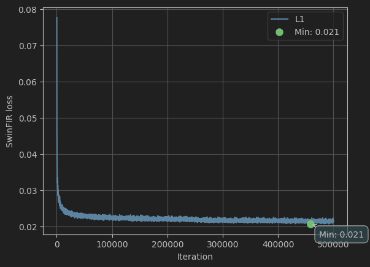 | 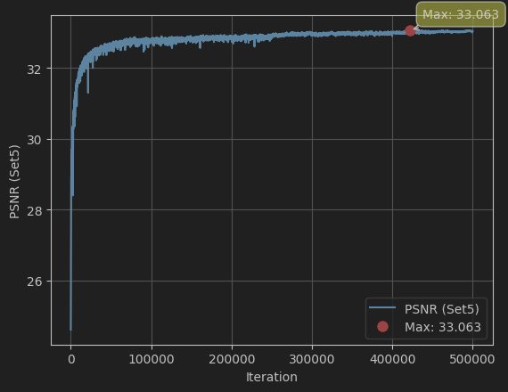 | 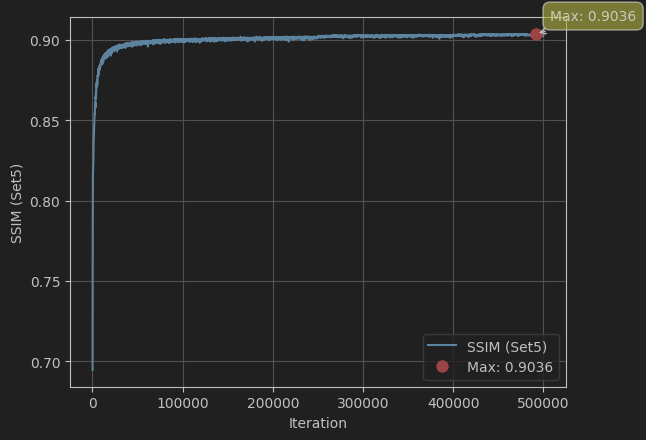 |

### HAT

Paper: [HAT: Hybrid Attention Transformer for Image Restoration](./papers/2309.05239v2-HAT.pdf)

#### Training

##### 2x Pre-training

| Loss                                            | PSNR                                            | SSIM                                            |
|-------------------------------------------------|-------------------------------------------------|-------------------------------------------------|
| 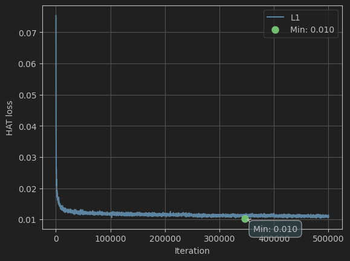 | 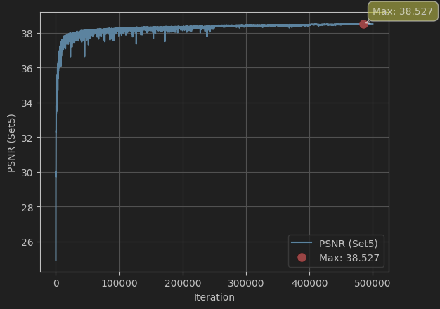 | 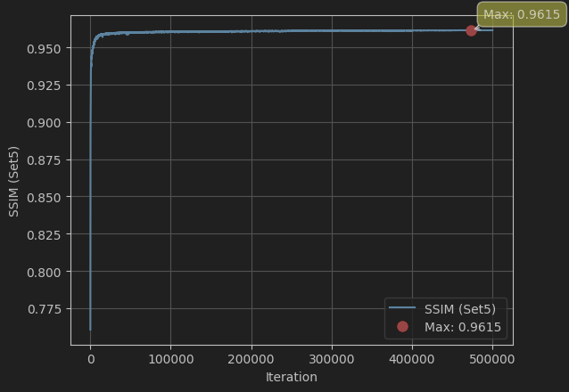 |

 

##### 4x Fine-tuning

| Loss                                            | PSNR                                            | SSIM                                            |
|-------------------------------------------------|-------------------------------------------------|-------------------------------------------------|
| 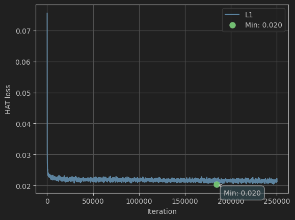 | 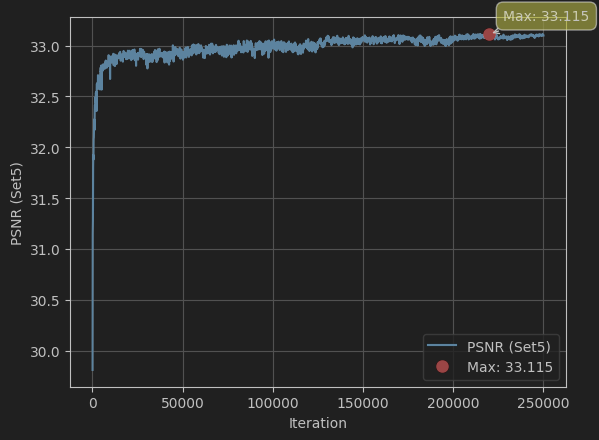 | 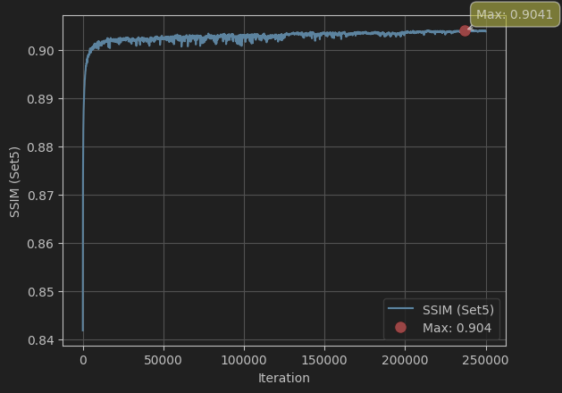 |

### DRCT

Paper: [DRCT: Saving Image Super-Resolution away from Information Bottleneck](./papers/2404.00722v5-DRCT.pdf)

#### Training

##### 2x Pre-training

| Loss                                             | PSNR                                             | SSIM                                             |
|--------------------------------------------------|--------------------------------------------------|--------------------------------------------------|
| 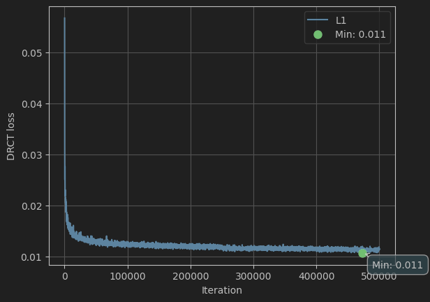 | 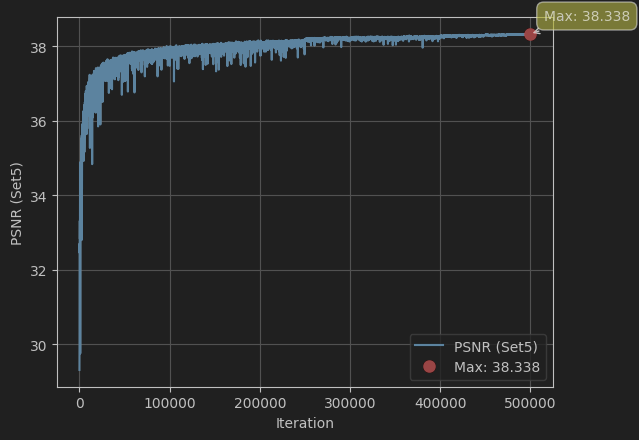 | 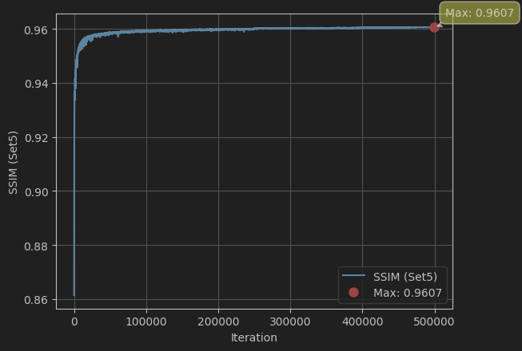 |

 

##### 4x Fine-tuning

| Loss                                             | PSNR                                             | SSIM                                             |
|--------------------------------------------------|--------------------------------------------------|--------------------------------------------------|
| 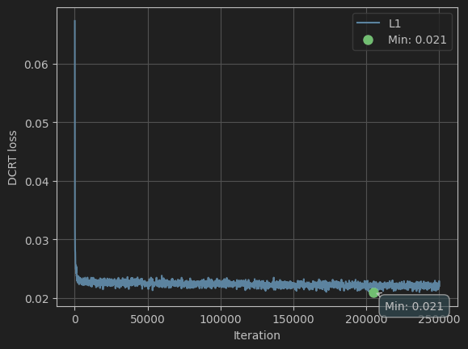 | 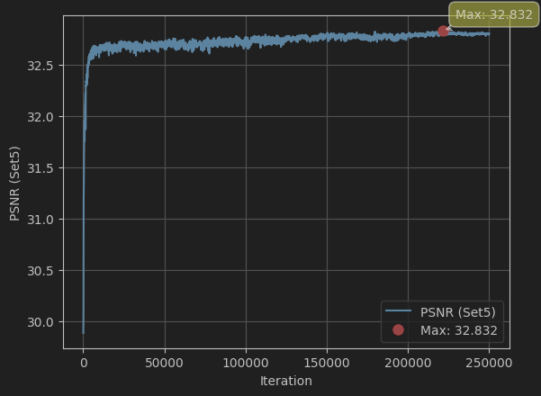 | 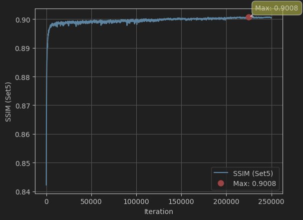 |

## Results

| **Method / Metric** | **PSNR (from paper)** | **SSIM (from paper)** | **PSNR (experiment)**                       | **SSIM (experiment)**                       |
|---------------------|-----------------------|-----------------------|---------------------------------------------|---------------------------------------------|
| **SwinIR**          | 32.72                 | 0.9021                | **32.986** | **0.9023** |
| **SwinFIR**         | 33.08                 | 0.9048                | **33.063**   | **0.9036**   |
| **HAT**             | 33.04                 | 0.9056                | **33.115** | **0.9041**   |
| **DRCT**            | 33.11                 | 0.9064                | **32.832**   | **0.9008**   |

**Table 1.** Results of experiments performing 4× super-resolution. *Note: The metrics were calculated using the Set5
dataset. Green values indicate results exceeding those published in the paper.*
